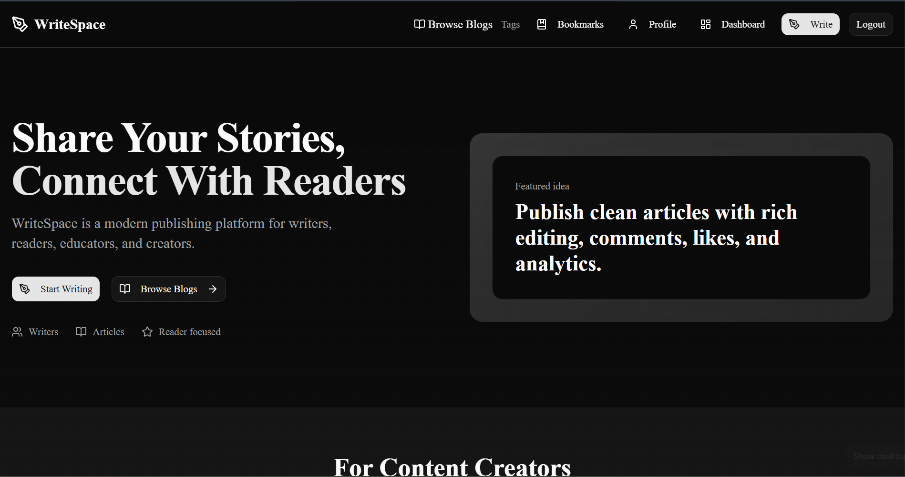
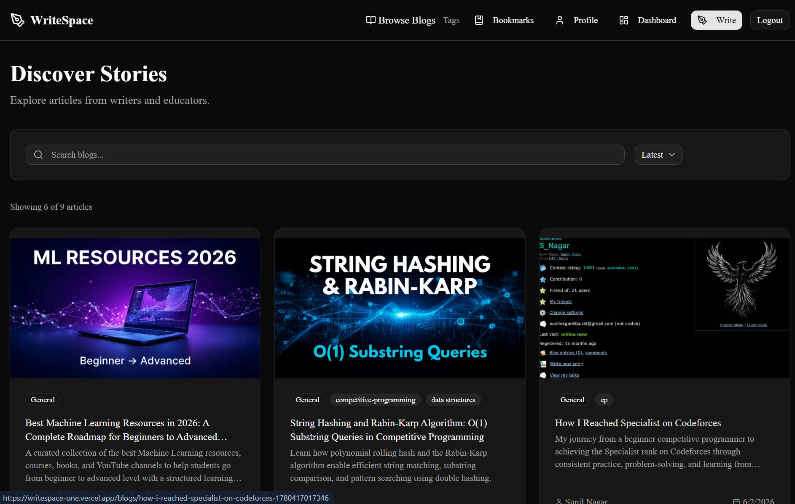
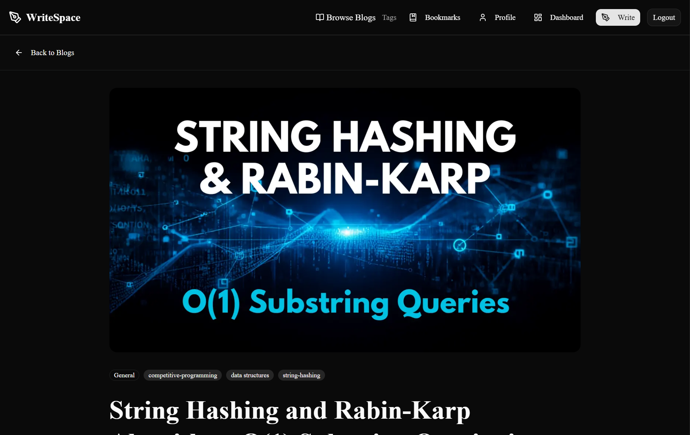
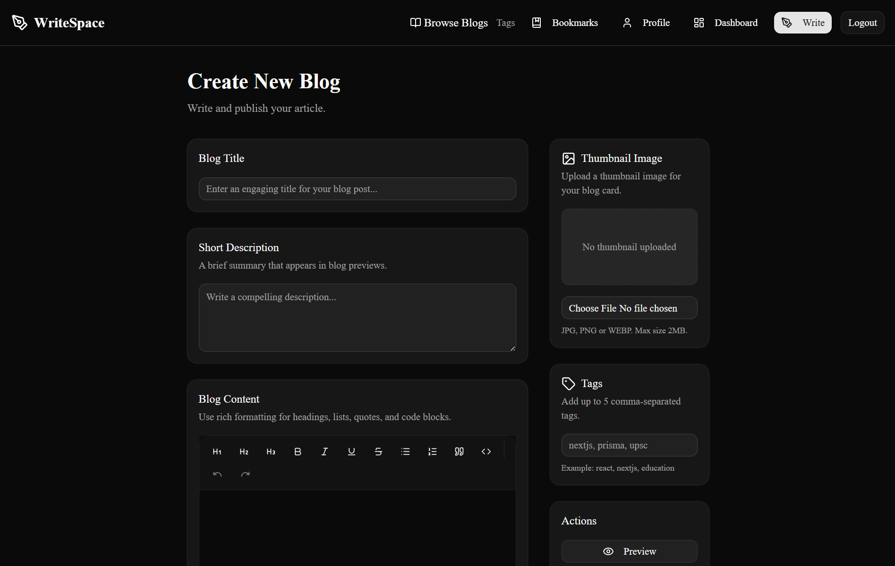
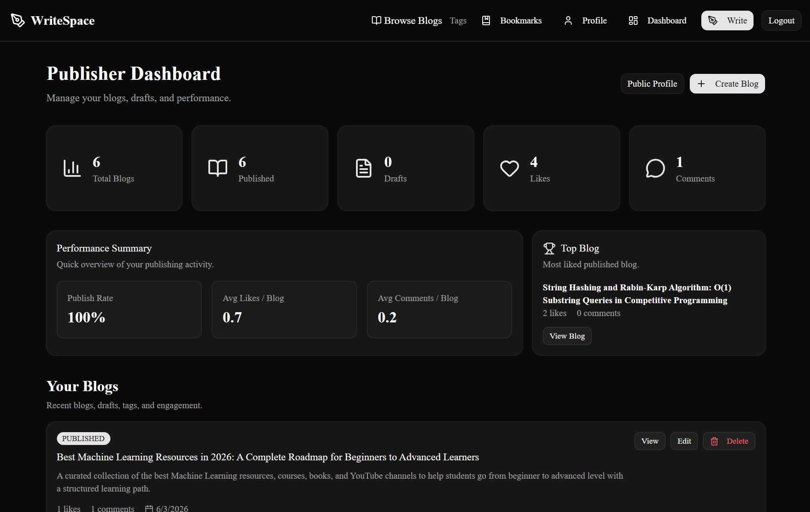
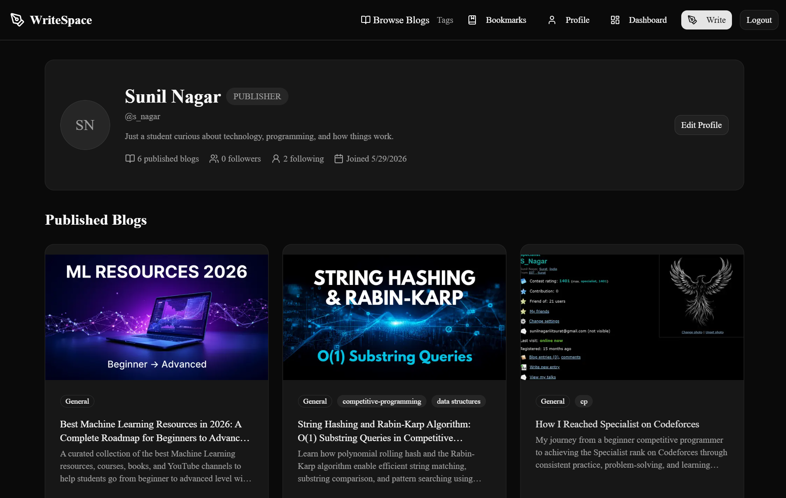
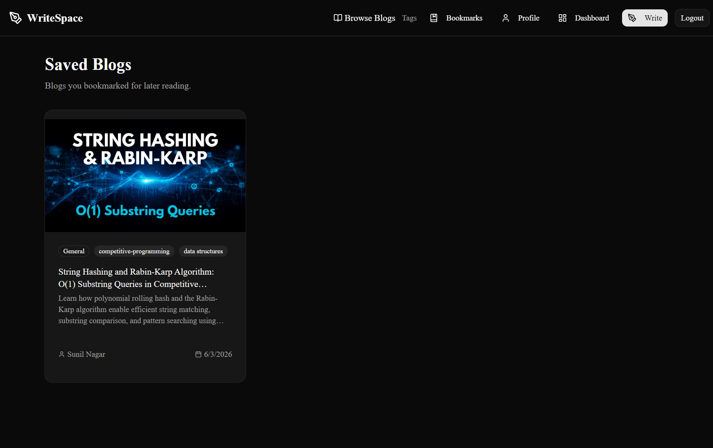
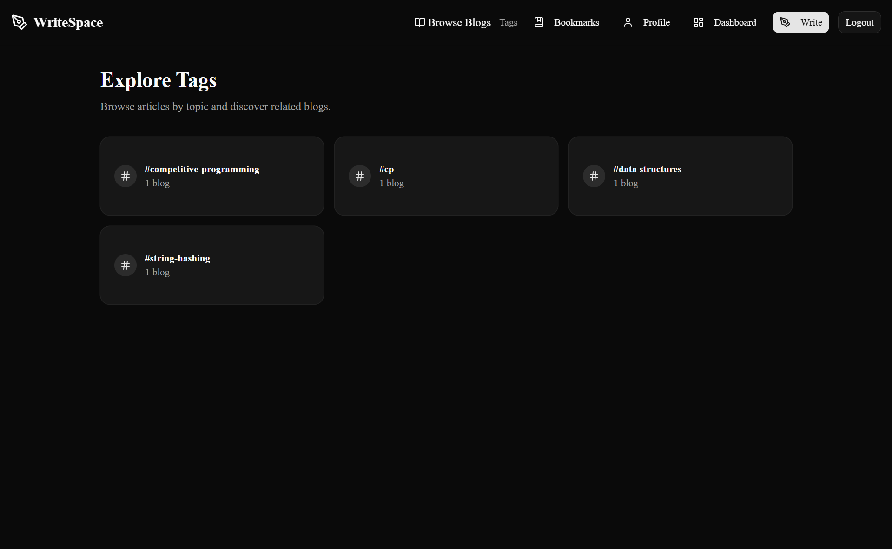

# WriteSpace

WriteSpace is a full-stack blogging platform where users can read, publish, bookmark, like, comment on, and follow writers.

**Live Demo:** https://writespace-one.vercel.app

---

## Features

- Email/password authentication
- Google OAuth authentication
- Mandatory username onboarding
- Reader and Publisher roles
- Create, edit, delete, draft, and publish blogs
- Rich text editor with code blocks
- Blog preview before publishing
- Cloudinary image uploads
- Tags system with tag pages
- Likes, comments, and bookmarks
- Follow/unfollow users
- Public profile pages
- Followers and following pages
- Publisher dashboard with analytics
- SEO metadata, sitemap, and robots.txt
- Fully responsive UI

---

## Tech Stack

- **Frontend:** Next.js 16 App Router, TypeScript, Tailwind CSS
- **UI:** shadcn/ui, lucide-react
- **Authentication:** Auth.js / NextAuth
- **Database:** PostgreSQL / Neon
- **ORM:** Prisma
- **Image Uploads:** Cloudinary
- **Deployment:** Vercel

---

## Screenshots

### Landing Page



### Blogs Page



### Blog Detail Page



### Create Blog Page



### Publisher Dashboard



### Profile Page



### Bookmarks Page



### Tags Page



---

## Main Pages

| Route | Description |
|---|---|
| `/` | Landing page |
| `/auth` | Login and signup |
| `/blogs` | Public blog feed |
| `/blogs/new` | Create blog page |
| `/blogs/[slug]` | Blog detail page |
| `/blogs/[slug]/edit` | Edit blog page |
| `/dashboard` | Publisher dashboard |
| `/profile/[username]` | Public user profile |
| `/profile/[username]/followers` | Followers list |
| `/profile/[username]/following` | Following list |
| `/bookmarks` | Saved blogs |
| `/tags` | All tags |
| `/tags/[name]` | Blogs by tag |
| `/settings/profile` | Profile settings |

---

## Environment Variables

Create a `.env.local` file and add:

```env
DATABASE_URL=

AUTH_SECRET=
AUTH_URL=
AUTH_TRUST_HOST=true
NEXTAUTH_URL=

AUTH_GOOGLE_ID=
AUTH_GOOGLE_SECRET=

NEXT_PUBLIC_APP_URL=

NEXT_PUBLIC_CLOUDINARY_CLOUD_NAME=
NEXT_PUBLIC_CLOUDINARY_UPLOAD_PRESET=
```

Example for local development:

```env
AUTH_URL=http://localhost:3000
NEXTAUTH_URL=http://localhost:3000
NEXT_PUBLIC_APP_URL=http://localhost:3000
AUTH_TRUST_HOST=true
```

For production, use your deployed URL:

```env
AUTH_URL=https://writespace-one.vercel.app
NEXTAUTH_URL=https://writespace-one.vercel.app
NEXT_PUBLIC_APP_URL=https://writespace-one.vercel.app
AUTH_TRUST_HOST=true
```

---

## Run Locally

```bash
git clone https://github.com/theofficialsunil/writespace.git
cd writespace
npm install
npx prisma generate
npm run dev
```

Open:

```txt
http://localhost:3000
```

---

## Database Setup

Run Prisma migration/generation commands when setting up the database:

```bash
npx prisma migrate dev
npx prisma generate
```

For production deployment, make sure the production `DATABASE_URL` is added in Vercel environment variables.

---

## Build

```bash
npm run build
```

The build script should generate the Prisma client before building Next.js:

```json
{
  "scripts": {
    "build": "prisma generate && next build"
  }
}
```

---

## Deployment

The project is deployed on Vercel with:

- Vercel for hosting
- Neon PostgreSQL for the database
- Cloudinary for image uploads
- Google OAuth for authentication

Production URL:

```txt
https://writespace-one.vercel.app
```

Google OAuth production redirect URI:

```txt
https://writespace-one.vercel.app/api/auth/callback/google
```

---

## Project Highlights

WriteSpace demonstrates:

- Full-stack application architecture
- Authentication and authorization
- Role-based access control
- Relational database modeling
- Server Actions
- Dynamic routing
- SEO-ready public pages
- Cloud image upload workflow
- Production deployment with environment configuration

---

## Future Improvements

- Email verification
- Forgot password flow
- Notifications
- Related blogs by tags
- Trending blogs and tags
- Admin dashboard
- Content moderation
- Full-text search
- Blog categories
- Rich editor image insertion
- Code block copy button
- Draft autosave
- Scheduled publishing
- Redis caching
- CI/CD with GitHub Actions

---

## Author

Built by [Sunil Nagar](https://github.com/theofficialsunil).
